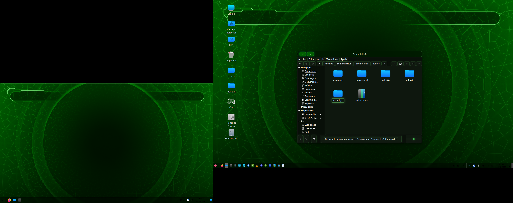

# EsmeraldHUB — Futuristic Xbox-Style GTK/Cinnamon/Metacity/GNOME Shell Theme



**EsmeraldHUB** es un tema futurista inspirado en la estética Xbox/HUD, compatible con Linux y con los entornos GTK3/GTK4, Cinnamon, Metacity y GNOME Shell.

---

## 🛠️ Instalación

### 1. Clonar el repositorio

```bash
git clone https://github.com/Shinobu-haruto/EsmeraldHUB.git ~/.themes/EsmeraldHUB
```

---

### 2. GTK3 / GTK4 Apps

- La carpeta `gtk-3.0/` contiene todos los widgets.
- Selecciona **EsmeraldHUB** en tu herramienta de temas GTK (por ejemplo, `gnome-tweaks` o `lxappearance`).

---

### 3. Cinnamon

- Selecciona el tema en **Configuración → Temas → Aplicaciones y Panel**.
- Incluye `cinnamon/` y `gtk-3.0/` para un look uniforme.

---

### 4. Metacity

- Selecciona el tema en **Cinnamon → Temas → Ventanas**.
- Los botones SVG se encuentran en `metacity-1/`.

---

### 5. GNOME Shell

- Copia la carpeta `gnome-shell/` dentro del tema.
- Reinicia GNOME Shell (`Alt+F2 → r`) o cierra sesión.
- Panel, menús y notificaciones adoptarán el estilo HUD/Xbox.

---

## 🎨 Características

- Headerbar trapezoidal con glow verde y botones HUD/Xbox  
- Botones normales y button-text con glow y transición suave  
- Checkboxes y radiobuttons estilo futurista  
- Progressbar, sliders y spinners integrados con HUD style  
- Notificaciones y popovers con glass/green glow  
- Panel superior y applets estilo Xbox/HUD  
- Botones SVG escalables para todos los entornos

---

## 📦 Contenido del repositorio

```
EsmeraldHUB/
├── gtk-3.0/           # Todos los widgets GTK
├── gtk-4.0/           # Widgets GTK4 (opcional)
├── cinnamon/          # Panel y applets
├── metacity-1/        # Botones SVG y decoración de ventanas
├── gnome-shell/       # Panel top bar, menus y notificaciones
├── preview-theme.png  # Imagen de vista previa
├── index.theme        # Archivo de registro del tema
├── LICENSE            # Licencia MIT
└── README.md
```

---

## 📄 Licencia

Este proyecto está bajo la **Licencia MIT**.  
Puedes ver el archivo completo de licencia en [`LICENSE`](LICENSE).

---

## ⚡ Créditos

- Diseño inspirado en HUD/futurista y estilo Xbox  
- Todos los SVG y CSS creados por **Shinobu Haruto**  
- Compatible con Linux y entornos GTK3/GTK4, Cinnamon, Metacity y GNOME Shell
